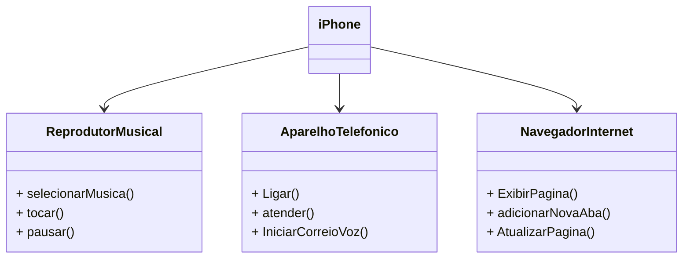

# iphone-UML

```mermaid
classDiagram
    class ReprodutorMusical {
        + selecionarMusica()
        + tocar ()
        + pausar ()
    }

    class AparelhoTelefonico {
       + Ligar ()
       + atender ()
       + IniciarCorreioVoz ()
    }

    class NavegadorInternet {
        + ExibirPagina()
        + adicionarNovaAba ()
        + AtualizarPagina()
        
    }

    class iPhone {
    }

    iPhone --> ReprodutorMusical
    iPhone --> AparelhoTelefonico
    iPhone --> NavegadorInternet
```
